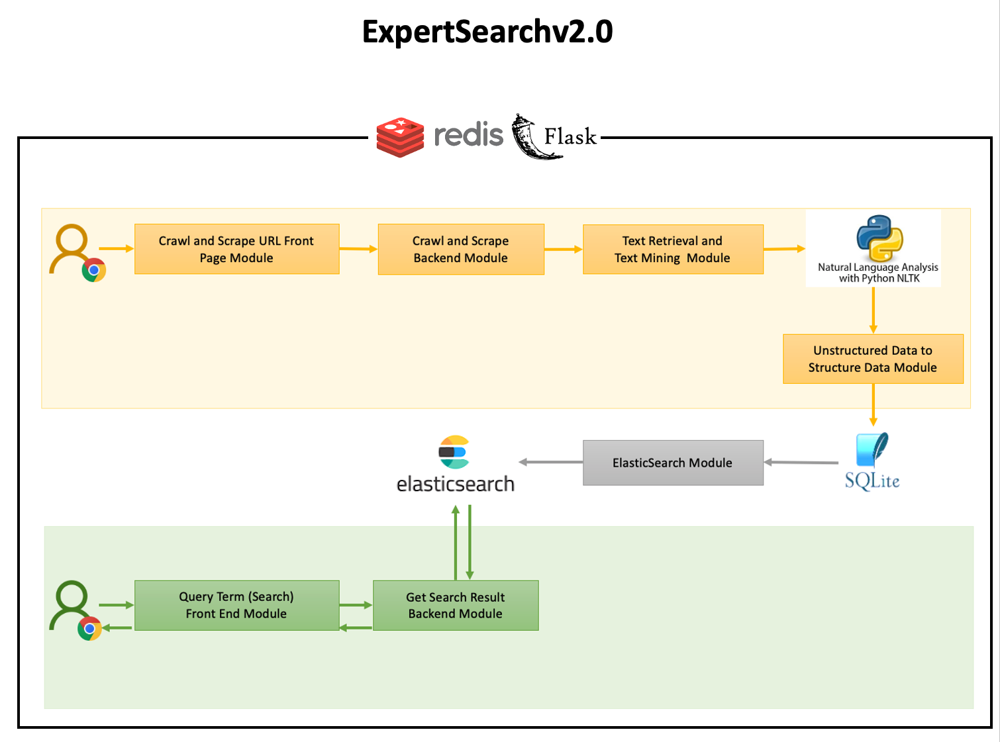

#  ExpertSearch v2.0

## Table of contents
* [Video Presentation](#video-presentation)
* [Using the ExpertSearch v2.0 Webapp](#using-the-expertsearch-v20-webapp)
* [Overview](#overview)
* [Technologies](#technologies)
* [Hardware Requirements](#hardware-requirements)
* [Access and Permission Requirements](#access-and-permission-requirements)
* [Software Requirements](#software-requirements)
* [Setup](#setup)
* [Deploy](#deploy)
* [Implementation Details](#implementation-details) 
* [Project Team Members](#project-team-members)
* [User Stories and Contributions](#user-stories-and-contributions)
* [Improvements Areas](#improvements-areas)
* [Licensing](#licensing)
* [Acknowledgements](#acknowledgements)
* [References](#references)

## Video Presentation

#### [Software usage tutorial presentation](https://uofi.box.com/s/h6gvq79zr6jzdri1vtjy30gi593mnukf) 
<sub><sup>MacOS   To open in a new tab: Cmd </sup></sub><kbd>⌘</kbd><sub><sup> + Click</sup></sub>      
<sub><sup>Windows   To open in a new tab: Cmd </sup></sub><kbd>⌃</kbd><sub><sup> + Click</sup></sub>      

## Using the ExpertSearch v2.0 Webapp
- - - - 
:warning: \
The team put all emphasis on the NLP, text retrieval, text mining techniques and aspects for faculty search. 
The webapp is the platform to display the outcomes of the implementation while putting everything together for demonstration purposes. 
However, making the webapp perfect in terms of end-to-end best user experience was not part of the goal for this project. 
The webapp still has got many improvement areas in terms of UX, UI display, communication, request response, industry standards and completeness which could be a separate project by itself.
While developing the ExpertSearch v2.0 we considered developing the prototype and leaving the opportunity to build things on top of this.      
- - - - 
#### Using Search Feature
1. Launch the app in your Chrome browser using the Demo URL: http://34.231.70.1:8095/  
2. The ExpertSearch v2.0 Home Page should be displayed.
3. Now try searching a faculty by entering queries like: 
    * Names can be provided such as Matt Caesar, Cheng Zhai, John Hart etc.
    * Location can be provided such as Illinois, Utah etc
    * Search queries can be provided such as deep learning, text information, visualization etc
4. ExpertSearch v2.0 should display search results along with the faculty attributes such as Name, Department Name, University Name, Areas of Interest, Phone number, Email and Location.
5. Few of the faculty attributes will be displayed as search results. A user can perform action on them such as clicking the email to open the local outlook composer, or clicking location to opt in for details from Google Maps etc.
    
#### Using Admin Feature
1. Go to the Admin interface using the settings buttons. Demo URL: http://34.231.70.1:8095/
2. Admin interface is a way for admin users (currently open for all users) to add universities, department and faculty urls for the system to be able to append and store additional faculty data to its database. This will result in broadening the search results and data availability. This is also a continuous process to enrich the system with much more data as they are explored.  
1. User can provide either university name or university url or department url. User can also specify University Name and Department name together in the search area.
2. The ExpertSearch v2.0 system would asynchronously start crawling and scraping data on the backend system and would also prompt the user that the data will be added through a background process eventually. 
3. As this is background update, user may come back after a while and search data related to newly entered university and the search results should get displayed given the background process has completed.
4. If a faculty is already present in the system, the system would not insert a duplicate record of the same faculty and will silently ignore the faculty in the process.

<div style="text-align: right"> <a href="#top">Back to top</a> </div>

## Overview

The ExpertSearch v2.0 application is a faculty search web application that uses NLP and Text Processing (Retrieval and Mining) abilities leveraging the in-built python NLP libraries.
The ExpertSearch v2.0 application was build on top the existing ExpertSearch web application [[1]](https://github.com/CS410Assignments/ExpertSearch) that has features such as faculty search, filtering based search, displaying search results (with options to open faculty bio pages, emailing, location info), pagination etc.\
As a team, we did a deep analysis of the current ExpertSearch capabilities and found several deficiencies that can be addressed to make it a better search system. 
The deficiencies include lack of accuracy in the search results, lack of relevant search results and inconsistencies in the search results, older and out of support python library usages, undocumented code and repo etc.\
These deficiencies can be addressed using the right text retrieval and text mining techniques along with some good practices that will improve the overall search experience in the ExpertSearch system.  
Our team was involved in implementing following features as we forked the existing ExpertSearch System and added/improved core-functionalities that we built on top of it. 
Below are the core functionalities that we added/improved on the existing ExpertSearch thereby calling it **ExpertSearch v2.0**:
<details>
   <summary>Converting unstructured dataset to structured dataset. Click to learn more</summary>
   <br/>
   <p>The new ExpertSearch v2.0 system can scrap faulty pages. By using text retrieval techniques, it extracts structured data such as Name, email, department name, university name, phone number, email, location, areas of interests etc. and saves in the database along with the scraped bio-data. 
   Whenever a user enters a search query, along with the optional filter used with the search query, the system grabs the bio-data from the database and ranks them using ElasticSearch Indexing ranking algorithm.
   After the ranking process is run, the system grabs the ranked data and gets corresponding faculty attributes from the structured database entry for the faculties.
   This makes the new system much more organized with data while maintaining consistency in displaying search results with uniformity in data.
   The existing ExpertSearch system doesn't have the structured data implementation and search results displays and very inconsistent. 
   </p>
   </p>
   
</details>     
 
<details>
   <summary>Topics extraction (e.g., areas of interest) for faculties and display in search results. Click to learn more.</summary>
   <br/>
   <p>The new ExpertSearch v2.0 implemented the innovative feature of displaying areas-of-interest for each faculty in the search results. 
   This was achieved by performing topic mining techniques on the faculty bio-data to extract most relevant topics.
   The areas of interests field, which is being displayed in the search results of faculty, is the outcome of this innovative approach.
   The existing ExpertSearch application doesn't have this feature.
   </p>
   </p>
   
</details>     

<details>
   <summary>Architected admin interface for auto crawling and scraping faculty pages asynchronously. Click to learn more.</summary>
   <br/>
   <p>In the new ExpertSearch v2.0 system the admin interface has been reengineered with many improvements and feature upgrades.
   Admin interface is primarily responsible to receive university input from user to parse, crawl, scrape the data and insert structured data to database.
   Below are few major upgrades in the Admin interface:
   </p>
   <ul>
       <li>User can now provide either university name or university url or department url. User can also specify University Name and Department name together.</li>
       <li>The Admin interface receives input from user and asynchronously responds to user that the database will be updated eventually. This is `eventual consistency` model. If user closes browser, the backend server will still be processing the crawling and scraping threads.</li>
       <li>User can keep entering multiple requests one after another and system will eventually process one after another in the background. There is no dependency with browser session. Although the system overall performance and security loopholes are out of scope for this project.</li>
       <li>As soon system extracts bio-data for the faculty url, it then extracts structured data using text retrieval and topic mining techniques and saves in database as structured data.</li>
   </ul>
   <p>The existing ExpertSearch system doesn't have these robust, user-friendly functionalities. The existing system doesn't also have mechanism to extract structured data from unstructured dataset.</p>
   </p>
   
</details>     

<details>
   <summary>Added more filter criteria. Click to learn more.</summary>
   <br/>
   <p>ExpertSearch v2.0 maintains structured data set in database. Based on search query with filters we can retrieve all saved bio-data matching the filters and apply elasticsearch ranking to only the filtered bio-data set for a specific query. 
   This is how the new system able to offer more filter criterion as compared to the existing ExpertSearch system</p>
   </p>
   
</details>     

<details>
   <summary>Improved search results with consistent display of the faculty attributes. Click to learn more.</summary>
   <br/>
   <p>New ExpertSearch v2.0 leverages the structured data to display faculty attributes in the search results display page. 
   The old ExpertSearch did runtime operations which A. makes the system slower for heavy text retrieval techniques and B. missed few modern text retrieval techniques for extracting fields such as department name, phone number etc.  
   We leveraged key browser provided information in html elements such as "title" which mostly provides unique info. 
   We also improved the regex package for extracting accurate phone numbers, email etc. 
   Since these operations are done during crawling and scraping and saved into database as structured data, hence during actual query based on the elasticsearch ranking results, the data is fetched from database. 
   The overall improved process resulted in improved search results and faculty attributes display with no missing information thus improving consistency.
   </p>
   
</details>     

<details>
   <summary>Major System upgrade from Python2.7 to Python3.9. Click to learn more.</summary>
   <br/>
   <p>New ExpertSearch v2.0 is build on latest Python3.9 and dependent packages compared to the existing ExpertSearch that is build on old and out of support Python2.7.
   With that said the team went through many research and exploration phases as few of the NLP / Text Processing libraries from old system aren't supported in Python3.9 version.
   New and modern standard libraries were tested and adopted (such as nltk, gensim etc.) and then engineered to fit the logic of indexing, ranking, scoring, topic mining and text retrieval techniques in the new ExpertSearch v2.0 system.
   In summary, all capabilities of existing ExpertSearch system have been covered by ExpertSearch v2.0 along with additional features like new set of Python3.9 libraries which by itself is a great achievement.       
   </p>
   
</details>     

<details>
   <summary>Documentation and Artifacts for future development. Click to learn more</summary>
   <br/>
   <p>The new ExpertSearch v2.0 comes with well documented modules, functions and modularized codes that overall improves the readability. 
   There are also design artifacts in terms of workflow diagrams that were generated for users to understand the features and functionality of the code. 
   This will encourage better participation for future development. 
   When compared to the existing ExpertSearch application, the existing web application has almost zero documentation and artifacts which made it very difficult for code analysis, code re-usability and increased the overall development window for enhancements. 
   Below snapshot demonstrates a good comparison between the existing and new ExpertSearch.
   </p>
   
</details>     

<div style="text-align: right"> <a href="#top">Back to top</a> </div>

## Technologies
Below are the main technologies that were used to build ExpertSearch v2.0 
* Python3.9
* Modern text Retrieval and Text Mining techniques
* Webpages crawling and scraping
* NLP Libraries - NLTK, Gensim, Spacy
* Redis Cluster
* Elastic Search
* Sqlite3 Database
* Web technologies like HTML, CSS, JQuery
* Flask based web server
 
## Hardware Requirements
1. Modern Operating System  [Minimum]\
Linux or MacOS  **[Recommended]**

2. x86 64-bit CPU  [Minimum] \
x86 64-bit CPU Multi Core **[Recommended]** 

3. 16 GB RAM  [Minimum]\
32 GB RAM  **[Recommended]**

4. 4 GB free disk space    [Minimum]\
8 GB free disk space  **[Recommended]**

<div style="text-align: right"> <a href="#top">Back to top</a> </div>

## Access and Permission Requirements

1. Access to the terminal window

2. A user with admin-level privileges

<div style="text-align: right"> <a href="#top">Back to top</a> </div>

## Software Requirements

1. Chrome Browser, Version 96+ and above
   * [Download and Install Chrome on MacOS](https://www.google.com/chrome/)
   * [Download and Install Chrome on Linux](https://linuxconfig.org/how-to-install-google-chrome-browser-on-linux)
 
2. Python3.9. 
   * Virtual environment is recommended.
   * [MacOS Conda Installation Guide](https://www.anaconda.com/products/individual) or [Linux Conda Installation Guide](https://docs.conda.io/projects/conda/en/latest/user-guide/install/linux.html)
   * [Managing Conda - Install python virtual environment using Conda](https://docs.conda.io/projects/conda/en/latest/user-guide/tasks/manage-environments.html) 
   
   Run the below command in virtual environment and Make sure you have installed Python3.9.X.
   ```shell script
   python --version
   ````
2. Java Runtime Environment (OpenJDK JRE)
   * [Linux/MacOS OpenJDK Installation Guide](https://openjdk.java.net/install/)
   
   Run the below command in virtual environment and make sure you have installed Python3.9.X.
   ```shell script
   python --version
   ````
      
3. `pip` package installed in python3.9 virtual environment  - _should be defaulted with Python3.9_   
   * To install pip on your virtual environment run below command
   ```shell script
   conda install pip 
    ````
4. git cli tool
    * [Install git](https://git-scm.com/book/en/v2/Getting-Started-Installing-Git)   

5. `make` tool

<div style="text-align: right"> <a href="#top">Back to top</a> </div>

## Setup

1. ElasticSearch Setup

   [Installing ElasticSearch on MacOS or Linux](https://www.elastic.co/guide/en/elasticsearch/reference/current/targz.html)

2. Redis Setup

   Installing Redis on MacOS or Linux
   ```shell script
   # get the stable version of redis 
   wget http://download.redis.io/redis-stable.tar.gz
  
   # extract 
   tar xvzf redis-stable.tar.gz
   cd redis-stable
  
   # install 
   make
   make install
   ```
      
3. Using git clone the repository to a path
   ```shell script
   cd <desired path where you want to download the project>
   git clone https://github.com/sudiptobilu/CourseProject.git
   cd CourseProject

4. Set `GOOGLE_API_KEY` Environment Variable\
   [Click Here](https://cmt3.research.microsoft.com/CS410Expo2021/Submission/Summary/56) to get the Google API Key from the [CMT](https://cmt3.research.microsoft.com/CS410Expo2021/Submission/Summary/56) Abstract section (Make sure you are in reviewer role. Credentials required). You can also use your own Google API Key if you have any.\
    Add the below line in your `~/.basrc` or `~/.bash_profile` 
    ```shell script
    export GOOGLE_API_KEY=<Add Google api Key from CMT Abstract section>
    ```
    Also create a `.env` file in project root directory of project and add the GOOGLE_API_KEY. Run the below commands
    ```shell script
    cd <path to CourseProject repo>
   
    echo "GOOGLE_API_KEY='<Add Google api Key from CMT Abstract section>'" > .env   
    ```  

5. Set `PYTHONPATH` Environment Variable\
    Add the below line in your `~/.basrc` or `~/.bash_profile` 
    ```shell script
    export PYTHONPATH="<path to CourseProject repo>"
    ```
    Also create a `.env` file in project root directory of project and add the PYTHONPATH. Run the below commands
    ```shell script
    cd <path to CourseProject repo>
   
    echo "PYTHONPATH='<path to CourseProject repo>'" > .env   
    ```  
6.  Source the `~/.basrc` or `~/.bash_profile` on your terminal
    ```shell script
    source ~/.basrc
   
    # or 

    source ~/.bash_profile 
    ```
    
7. Switch to the Python3.9 virtual environment\
   If using Conda,
   ```shell script
   # TIP: Show all conda environment
   conda env list   
   
   # pick the Python3.9 environment name from the above output. Then run
   conda activate <python3.9 virtual environment name> 
   ```

8. Install the project requirements file on Python3.9 virtual environment
    ```shell script
    pip install -r requirements.txt
    ```
<div style="text-align: right"> <a href="#top">Back to top</a> </div>

## Deploy
1. On a separate terminal, Start ElasticSearch Service (preferably on a screen session)

    For MacOS or Linux 
    ```shell script
    cd <path to elasticsearch>
    ./bin/elasticsearch
    ````

1. On a separate terminal, Start Redis Server (preferably on a screen session)

    For MacOS or Linux 
    ```shell script
    cd <path to redis-stable>
    redis-server
    ````

2. Make sure you are on the Python3.9 environment. 
    ```shell script
   python --version
    ````
3. On a separate terminal, from the project directory, Run the redis `crawler-worker` (preferably on a screen session)
    ```shell script
    # go to project directory root level
    cd <path to CourseProject repo>
    
    rq worker crawler-worker 
    ````

3. On a separate terminal, from the project directory, Launch the ExpertSearch v2.0 server  (preferably on a screen session)
    ```shell script
    # go to project directory root level
    cd <path to CourseProject repo>
    
    python apps/frontend/server.py
    ````
4. Open Chrome browser and browse the below url
    ```shell script
   http://localhost:8095
   
   http://<localhost_ip>:8095
    ````
5. The browser should display ExpertSearch v2.0 search application 

:exclamation: A comprehensive software usage [video presentation](https://uofi.app.box.com/file/893368706848?s=ealry89ittv21gz2x30bn2lrw319vhnw) is also available. [Click Here](https://uofi.app.box.com/file/893368706848?s=ealry89ittv21gz2x30bn2lrw319vhnw)

<div style="text-align: right"> <a href="#top">Back to top</a> </div>

## Implementation Details 




:pushpin: :pushpin:     
#### ExpertSearch v2.0 Admin Functionality (Contribute with URL for Crawling Interface)

* Admin interface is primarily responsible for receiving university/department/faculty name or urls as input from user to parse, crawl, scrape data, retrieve fields using various text mining approaches and insert structured data to database.
* The purpose of Admin is to add more data from admin provided urls to broaden the search results and add more data availability. This is also a continuous process to enrich the system with more and more data as they are available or explored.
* For admin functionality the front end file is located at [web/templates/admin.html](web/templates/admin.html)
* User provides either university name or university url or department url. User can also specify University Name and Department name together.
* The Admin interface receives input from user and asynchronously responds to user that the database will be updated eventually. This is `eventual consistancy` model. If user closes browser, the backend server will still be processing the crawling and scraping.
* For this we have two instances of server running at the front end. 
    1. [apps/frontend/server.py::crawl()](apps/frontend/server.py) that accepts university crawl/scrape requests from the user and lets the user know that it will eventually process the data.  
    2. A redis instance runs that queues the actual crawl requests and passes the requests to TODO.
* If user passed a name and not an url, then we are using Google API service [apps/backend/api/googleapi.py](apps/backend/api/googleapi.py) to extract the url from university and department name.
* Once the URL is extracted, the crawler [apps/frontend/crawler/crawler.py](apps/frontend/crawler/crawler.py) crawls and finds all the faculty home page urls.
* The faculty homepage urls are then provided to [apps/frontend/crawler/faculty_url_scrapper.py](apps/frontend/crawler/faculty_url_scrapper.py) for scraping the data and saving the data into database as structured data. The `faculty_url_scrapper` is an orchestration module that performs multiple steps for extracting structured data from the unstructured data and saving it in database. Below are few major tasks it performs:
    * Once the faculty data is scraped, it is then passed to [apps/backend/utils/document.py](apps/backend/utils/document.py). The `Document` class has then calls the text retrieval and text mining extraction functions to extract Faculty Name, Faculty Contact Number, email, department name, university name, location, areas of interests etc. 
        * Phone number, Email is extracted using regex technique
        * Department name, University Name and Faculty Name are extracted from html `title` element from their corresponding urls page source code
        * Location data is extracted using the Google API Service
        * Faculty area of interests are extracted using the Gensim LDA Topic mining method (Text Mining technique)
    * At this stage we have both A. the structured data and also B. Scraped data (as unstructured data) for each faculty
    * Both structured data along with the raw bio-data are then inserted to [data/sqlite3/faculty.db](data/sqlite3/) database using the class [apps/backend/utils/facultydb.py::add_records()](apps/backend/utils/facultydb.py) 

:bangbang: The entire workflow and code discussed above is all new work in the ExpertSearch v2.0 that has been done. Tasks involved adapting new libraries for Python3.9, explorations, PoCs, and then designing an effective workflow and implementing it.   

<details>
   <summary>Click to See the Workflow Diagram of Admin Functionality</summary>
   <br/>
   
</details>

- - - - 

:pushpin: :pushpin:     
#### ExpertSearch v2.0 Search Functionality

* For search functionality the front end file is located at [web/templates/index.html](web/templates/index.html)
* User enters query to the html file (user can provide filters too) which is passed to the backend Flask server [apps/frontend/server.py::search()](apps/frontend/server.py) as a http request
* The server receives the query string and calls [apps/frontend/server.py::search()](apps/frontend/server.py)
* The `search` in turn calls an orchestration function [apps/backend/api/search.py::get_search_results()](apps/backend/api/search.py)
* The `get_search_results` is an orchestration function and calls different backend systems to retrieve the data
    * The call first goes to [apps/backend/utils/facultydb.py::get_biodata_records()](apps/backend/utils/facultydb.py) and grabs all scraped bio-data stored in a database table column along with corresponding structured data id.
    * Then the corpus data is passed to [apps/backend/utils/ranker.py::score()](apps/backend/utils/ranker.py) to score the corpus bio-data dataset based on search query. The function used elasticsearch ranking abilities to rank corpus documents.
    * Once ranking is done the corresponding structured data ids were returned as a ranked list of faculty ids 
    * The ranked ids were taken and passed to [apps/backend/utils/facultydb.py::get_faculty_records()](apps/backend/utils/facultydb.py) to get the structured data from database
* The result's dataset is now a structured data with key pair values being displayed in the front end accordingly
* The benefit of displaying structured data is consistency in displaying results and all the attributes and allowing certain user actions on them. (for e.g. send email, explore location etc.)

:bangbang: The entire workflow and code discussed above is all new work in the ExpertSearch v2.0 that has been done. Tasks involved adapting new libraries for Python3.9, explorations, PoCs, and then designing an effective workflow and implementing it.   

<details>
   <summary>Click to See the Workflow Diagram of Search Functionality</summary>
   <br/>
   
</details>

- - - - 

<div style="text-align: right"> <a href="#top">Back to top</a> </div>

## Project Team Members

| Name          | NetID    | Email                 |
|:----------------|:---------|:----------------------|
| Ujjal Saha      | ujjals2  | ujjals2@illinois.edu  |
| Arnab KarSarkar | arnabk2  | arnabk2@illinois.edu  |
| Sudipto Sarkar  | sudipto2 | sudipto2@illinois.edu |

<div style="text-align: right"> <a href="#top">Back to top</a> </div>

## User Stories and Contributions

- - - - 
1. **Epic: Crawling and Scraping** &nbsp;&nbsp;&nbsp;&nbsp;&nbsp; _(Contributions :clap: &nbsp;&nbsp;: Arnab KarSarkar, Ujjal Saha)_
    <details>
       <summary><b>User Story: </b> Crawler Implementation for a given webpage url. Click for Story Details</summary>
       <br/>
       <p>In the admin interface when admin inputs an url, this story takes the url as input and scrapes the page and extracts the faculty bio-data. We also implemented intelligent logic in scraper to find right faculty page if the base url has links that led to multiple faculty related pages.</p>
    </details>     

    <details>
       <summary><b>User Story: </b> Adding admin interface for web page indexing. Click for Story Details</summary>
       <br/>
       <p>As our project scope does not include auto crawler features for the entire web, the admin interface we are implementing in ExpertSearch system allows the admin to enter base url of the university and based on valid/invalid university email (different story), the admin interface will fetch the url to the crawler module to scrape faculty data.</p>
    </details>     
    
    <details>
       <summary><b>User Story: </b> Displaying accepted/rejected web page based on url. Click for Story Details</summary>
       <br/>
       <p>When admin enters the base url, this module will check if the url is a valid university url. If yes, the module forwards the url for crawling and scraping the faculty pages. If not, the module lets the admin know that base url does not belong to a university or no faculty page found.</p>
    </details>     
    
- - - - 

2. **Epic: Search Experience Enhancement using Text Retrieval Techniques** &nbsp;&nbsp;&nbsp;&nbsp;&nbsp; _(Contributions :clap: &nbsp;&nbsp;: Ujjal Saha, Sudipto Sarkar)_
    <details>
       <summary><b>User Story: </b> Build a structured dataset from Unstructured datasets. Click for Story Details</summary>
       <br/>
       <p>In current ExpertSearch system the faculty data are stored as unstructured data as a file. We are implementing a functionality that will convert the unstructured data to structured data. For e.g., using text mining and text retrieval techniques we are planning to extract fields like Faculty Name, Department, University, Area of Interests, email, phone, etc. and store them in a structured form (either in csv, or database etc.). This will enhance the overall search experience.</p>
    </details>     
     
    <details>
       <summary><b>User Story: </b> Enhance the search experience with relevant search results. Click for Story Details</summary>
       <br/>
       <p>Based on search input, we will look up all bio-data from structured dataset and implement a elasticsearch ranking. Based on elasticsearch ranking results we will extract corresponding fields from the structured data and display as search results. We will enhance filter based searching feature too, where user can get better accuracy because of structured dataset.</p>
    </details>     
      
    <details>
       <summary><b>User Story: </b> Better consistency in displaying attributes by leveraging structured data. Click for Story Details</summary>
       <br/>
       <p>The current expert search system does not show contact info (email, etc.) consistently across the search results even if the faculty page does have the data. Our improved scraping and structured data along with improved data display logic will increase the consistency in displaying the fields in search results.</p>
    </details>     

- - - - 

3. **Epic: Topic Mining** &nbsp;&nbsp;&nbsp;&nbsp;&nbsp; _(Contributions :clap: &nbsp;&nbsp;: Sudipto Sarkar, Arnab KarSarkar)_   

    <details>
       <summary><b>User Story: </b> Using text mining methodologies extract interest areas of a faculty. Click for Story Details</summary>
       <br/>
       <p>Using text mining methods we are planning to generate “Areas of Interests” data from the faculty bio. We are using Trained LDA model, NER taggers and Gensim/NLTK libraries along with its parameter set variations to generate relevant topics.</p>
    </details>     
    
    <details>
       <summary><b>User Story: </b> Display Areas of Interest in the faculty search result. Click for Story Details</summary>
       <br/>
       <p>We are enhancing the front end of ExpertSearch to display faculty search results along with additional relevant fields such as faculty areas of interest and few more.</p>
    </details>     

- - - - 

4. **Epic: Deployment** &nbsp;&nbsp;&nbsp;&nbsp;&nbsp; _(Contributions :clap: &nbsp;&nbsp;: Arnab KarSarkar, Ujjal Saha, Sudipto Sarkar)_

    <details>
       <summary><b>User Story: </b> Understand and Install current ExpertSearch System. Click for Story Details</summary>
       <br/>
       <p>Install and explore the ExpertSearch system and understand the features and functionalities (both frontend and backend). Experiment with code changes etc.</p>
    </details>     
 
    <details>
       <summary><b>User Story: </b> Deploy code into AWS. Click for Story Details</summary>
       <br/>
       <p>Being web-based framework, we will do our deployments in AWS Cloud and make it public. We will also do a git PR on the existing original ExpertSearch repo. But launching as an improved system and others to validate, we will separately host ExpertSearch v2.0 in AWS.</p>
    </details>     

    <details>
       <summary><b>User Story: </b> Validation Exercises. Click for Story Details</summary>
       <br/>
       <p>As we do development and deployment, we are doing multiple rounds of verification and validation and some will require integrated end-to-end validation steps.</p>
    </details>     

- - - - 

5. **Epic: Documentation and Presentation** &nbsp;&nbsp;&nbsp;&nbsp;&nbsp; _(Contributions :clap: &nbsp;&nbsp;: Ujjal Saha, Sudipto Sarkar, Arnab KarSarkar)_   

    **User Story**: Proposal Documentation 
       
    **User Story**: project Progress Documentation
    
    **User Story**: Final Project Report Documentation  
    
    **User Story**: Final Project Video Presentation  

- - - - 

    

<div style="text-align: right"> <a href="#top">Back to top</a> </div>

## Improvements Areas
* Crawling and Scraping activities can be tracked if implemented as a publisher and subscriber. However, we did not pursue it as it would not add much value to our goal and focus on Text Retrieval and Mining techniques.
* There is huge opportunity to improve the crawling and scraping feature. Each university has their own styling in website url names and page contents. So more we explore more logical scenarios we can add so more pages can be crawled with a generic implementation. 
* Many times a faculty has multiple homepage urls and the system. In the main homepage url there could be multiple links and requires more intelligent to identify which page is the main homepage url.
* We have used trained LDA Model which generated better output of topical data. However, future research can be done to check if using a trained model alongside a specialized topic mining with seeded datasets could result is more relevant topic words for a faculty. We also explored GuidedLDA and did not find any improvements either.  
* Admin interface repeated entry can be malicious and hence there is a need to implement some sort of restrictions
* Making the webapp perfect in terms of end-to-end best user experience was not part of the goal for this project. The webapp still has got many improvement areas in terms of UX, UI display, communication, request response structure, industry standards, completeness which could be a separate project by itself.
* We were only able to crawl and scrape HTML from US universities. Any international university may or may not work with the current implementation. 

## Licensing
The ExpertSearch v2.0 was build upon existing ExpertSearch web application [[1]](https://github.com/CS410Assignments/ExpertSearch) and thus will inherit the original licensing terms and conditions of the original ExpertSearch system.  

## Acknowledgements
* Our special thanks to [Prof. Cheng Zhai](http://czhai.cs.illinois.edu/) and all the TAs in CS410 Text Information Systems Course for making the course engaging and help with all the queries.
* Many thanks to original creators of existing ExpertSearch web application [[1]](https://github.com/CS410Assignments/ExpertSearch) and letting others build on top of it.
* Also thanks to our open source community contributors for so many contributions in NLP, Text Retrieval and Text Mining based python packages which are effective, efficient and free to use.
* Thanks to our project team members and project reviewers too for wonderful collaboration and feedback and making the project successful.      
* Special thanks for University of Illinois - Urbana Champaign for providing students with endless software tools, collaboration mediums and resources such as box, sharepoint, Google Drive, library, zoom, slack, CampusWire and many more. The availability of these tools help online students a lot.      
## References
[1] [Existing ExpertSearch web application](https://github.com/CS410Assignments/ExpertSearch)\
[2] [Coursera - CS410 Text information Systems - Course Project Overview](https://www.coursera.org/learn/cs-410/supplement/fTuOi/course-project-overview)\
[3] [NLTK API Reference](https://www.nltk.org/api/nltk.html)\
[4] [Gensim API Reference](https://radimrehurek.com/gensim/apiref.html)\
[5] [Topic Modelling in Python with NLTK and Gensim](https://towardsdatascience.com/topic-modelling-in-python-with-nltk-and-gensim-4ef03213cd21)  
[6] [Beginners Guide to Topic Modeling in Python](https://www.analyticsvidhya.com/blog/2016/08/beginners-guide-to-topic-modeling-in-python/)\
[7] [BM25 Ranker](https://github.com/dorianbrown/rank_bm25)\
[8] [Flask + Bootstrap. HTML interface for effortless Python projects](https://diyprojects.io/flask-bootstrap-html-interface-effortless-python-projects/#.YbEIE33MLok)\
[9] [How to Use Redis With Python](https://realpython.com/python-redis/)\
[10] [Python Elasticsearch Getting Started Guide](https://www.hackdeploy.com/python-elasticsearch-getting-started-guide/)\
[11] [AWS Cloud Hosting Service - EC2](https://aws.amazon.com/application-hosting/)\
[12] [Github ReadMe - Basic writing and formatting syntax](https://docs.github.com/en/github/writing-on-github/getting-started-with-writing-and-formatting-on-github/basic-writing-and-formatting-syntax)

<div style="text-align: right"> <a href="#top">Back to top</a> </div>
